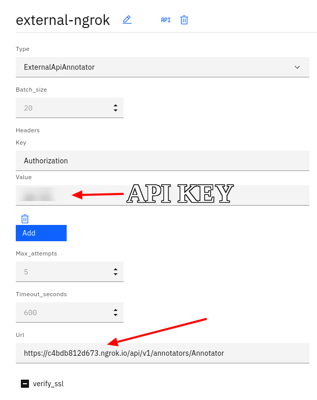
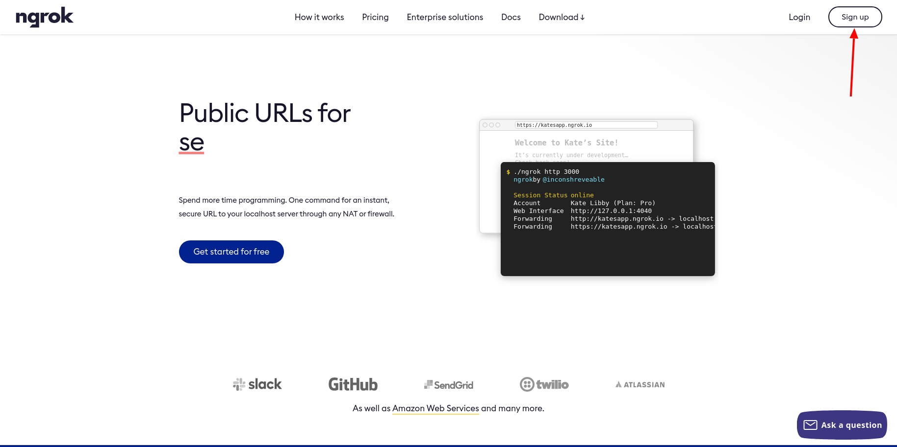
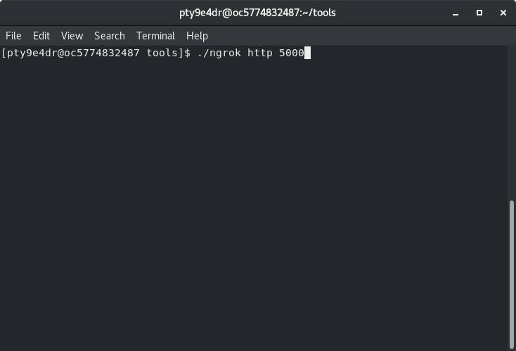
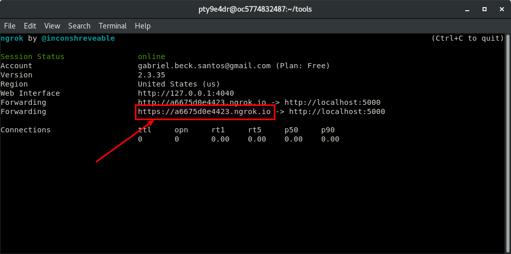

# DeepSearch NLP Annotator API Example

This repository contains a simple annotator fulfilling the interface
required by CPS. It is meant to be cloned, and then adapted to specific models.

In terms of functionality, the current code finds cities, countries, and provinces in texts and tables, using dictionaries.

The following entities are exposed:

| Entity name  | Description |
| ------------ | ----------- |
| `cities` | Match with the cities dictionary |
| `provincies` | Provinces, states, etc. matching the provincies dictionary |
| `countries` | Match with the countries dictionary |


The following relationships are exposed:

| Relationship name  | Description |
| ------------ | ----------- |
| `cities-to-countries` | Relationship between the matched cities and countries. |
| `cities-to-provincies` | Relationship between the matched cities and provincies.  |
| `provincies-to-countries` | Relationship between the matched provincies and countries. |


The following properties are exposed in the small example (without actual AI models):

| Property name  | Description |
| ------------ | ----------- |
| `length` | Length of provided text (paragraph, table cell etc.) classified as small, middle, or long |


## Table of content

- [Running the Annotator Application](#running-the-annotator-application)
    - How to launch locally
    - Example input and output
- [Use the Annotator in CPS](#use-the-annotator-in-cps)
    - How to configure the model in CPS
- [Using an Ngrok Tunnel](#using-an-ngrok-tunnel)
    - Example of local development connected to CPS
- [Deploying the application](#deploying-the-application)
    - How to deploy for production usage
- [Develop a new annotator](#develop-a-new-annotator)
    - How to add your own annotator


## Running the Annotator Application
To install the dependencies: 
```sh
python3 -m venv venv
source ./venv/bin/activate
pip install -r requirements.txt
```
To run:
```sh
python3 -m nlp_annotator_api.server.app
```

By default it will read the file `config.json`, which has an authentication `test 123`.


## Testing the Application Locally
With the default parameters, the application runs on http://localhost:5000/api/v1/annotators/. The next parameter is the annotator name. Thus the actual URL is http://localhost:5000/api/v1/annotators/SimpleTextGeographyAnnotator.

The application is exposing an interactive Swagger UI interface, which is reachable at http://localhost:5000/api/v1/ui/.


### Finding Entities in Text
You can test it as in the following example:
```sh
curl -X POST -H "Content-Type: application/json" -H  "Authorization: test 123"\
    -d '{"find_entities": {"object_type": "text", "entity_names": ["cities", "countries", "provincies"], "texts": ["New Delhi is the capital of India.", "Baden-Württemberg is a state of Germany."]}}' \
    http://localhost:5000/api/v1/annotators/SimpleTextGeographyAnnotator
```

Here is the request body in more readable format. 
* `object_type` is what you will pass, here text, not tables or images.
* With `entity_names` you can restrict which entities you want to get, if the annotator offers several types. If the list is empty, all possible entities will be returned.
* `texts` is a list of sentences to annotate.

```json
{
  "find_entities": {
    "object_type": "text",
    "entity_names": [
        "cities", 
        "countries", 
        "provincies"      
    ],
    "texts": [
      "New Delhi is the capital of India.", 
      "Baden-Württemberg is a state of Germany."
      ]
  }
}
```

Response for this query:
```json
{
  "entities": [
    {"cities": [
       {"type": "cities", 
        "match": "Delhi", 
        "original": "Delhi", 
        "range": [4, 9]}, 
       {"type": "cities", 
        "match": "New Delhi", 
        "original": "New Delhi", 
        "range": [0, 9]}
      ], 
     "countries": [
       {"type": "countries", 
        "match": "India", 
        "original": "India", 
        "range": [28, 33]}
      ], 
     "provincies": [
       {"type": "provincies", 
        "match": "Delhi", 
        "original": "Delhi", 
        "range": [4, 9]}
      ]
    }, 
    {"cities": [], 
     "countries": [
       {"type": "countries", 
        "match": "Germany", 
        "original": "Germany", 
        "range": [32, 39]}
       ], 
     "provincies": [
       {"type": "provincies", 
       "match": "Baden-W\u00fcrttemberg", 
       "original": "Baden-W\u00fcrttemberg", 
       "range": [0, 17]}
      ]
    }
  ]
}
```

### Querying Annotator Capabilities
You can also query the capabilities of this annotator:
```sh
curl -X POST -H "Content-Type: application/json" -H  "Authorization: test 123"\
    -d '{"features": {"entity_names": true, "relationship_names": true, "property_names": true, "labels": true}}' \
    http://localhost:5000/api/v1/annotators/SimpleTextGeographyAnnotator
```

Body in nicer format:
```json
{
  "features": {
    "entity_names": true,
    "relationship_names": true,
    "property_names": true,
    "labels": true
  }
}
```

Expected response:
```json
{
  "entity_names": [
    "countries",
    "cities",
    "provincies"
  ],
  "relationship_names": [
    "cities-to-countries",
    "cities-to-provincies",
    "provincies-to-countries"
  ],
  "property_names": [],
  "supported_object_types": [
    "text",
    "tables"
  ],
  "labels": {
    "entities": [
      {
        "key": "countries",
        "description": "Names of countries"
      },
      {
        "key": "cities",
        "description": "Names of cities"
      },
      {
        "key": "provincies",
        "description": "Names of provinces, states, and similar units"
      }
    ],
    "relationships": [
      {
        "key": "cities-to-countries",
        "description": "In-sentence relationship between entities ('cities', 'countries')",
        "columns": [
          {
            "key": "cities",
            "entities": [
              "cities"
            ]
          },
          {
            "key": "countries",
            "entities": [
              "countries"
            ]
          }
        ]
      },
      {
        "key": "cities-to-provincies",
        "description": "In-sentence relationship between entities ('cities', 'provincies')",
        "columns": [
          {
            "key": "cities",
            "entities": [
              "cities"
            ]
          },
          {
            "key": "provincies",
            "entities": [
              "provincies"
            ]
          }
        ]
      },
      {
        "key": "provincies-to-countries",
        "description": "In-sentence relationship between entities ('provincies', 'countries')",
        "columns": [
          {
            "key": "provincies",
            "entities": [
              "provincies"
            ]
          },
          {
            "key": "countries",
            "entities": [
              "countries"
            ]
          }
        ]
      }
    ]
  }
}
```

### Finding Entities in Tables
This annotator also handles table objects. To test it locally, here is a request with a 1-cell table:
```sh
curl -X POST -H "Content-Type: application/json" -H  "Authorization: test 123"\
    -d '{"find_entities": {"object_type": "table", "entity_names": ["cities", "countries"], "tables": [[[{"bbox": [], "spans": [[0, 0]], "text": "Bern, Switzerland", "type": "col_header"}]]]}}' \
    http://localhost:5000/api/v1/annotators/TextTableGeographyAnnotator
```


### Finding Relationships
For finding relationships in a text, you have to provide both the text and the entities as found by the entities annotator. 
Below is an example request body, to be used with the same headers and URL as above: 
```json
{
  "find_relationships": {
    "texts": ["Lisbon is the capital and the largest city of Portugal"],
    "entities": [{
      "cities": [
        {
          "type": "cities",
          "match": "Lisbon",
          "original": "Lisbon",
          "range": [
            0,
            6
          ]
        }
      ],
      "countries": [
        {
          "type": "countries",
          "match": "Portugal",
          "original": "Portugal",
          "range": [
            46,
            54
          ]
        }
      ]
    }],
    "object_type": "text",
    "relationship_names": ["cities-to-countries"]
  }
}
```

Response. In the "data" part, the entities are not substituted in (the CPS UI will do that), but given by reference. E.g., "cities.0" is the first city, here Lisbon. 
```json
{
  "relationships": [
    {
      "cities-to-countries": {
        "header": [
          "i",
          "j",
          "weight",
          "source"
        ],
        "data": [
          [
            "cities.0",
            "countries.0",
            1,
            "entities"
          ]
        ]
      }
    }
  ]
}
```

### Classifying Texts
You can test the sample annotator as in the following example:
```
curl -X POST -H "Content-Type: application/json" -H  "Authorization: test 123"\
    -d '{"find_properties": {"object_type": "text", "property_names": ["length", "category"], "texts": ["Definition: Fruit are sweet edible products of plant blossoms.", "Apples grow on apple trees and grow after the beautiful apple blossoms were visited by bees. Most people like apples. Doctors and nutritionist recommend that we eat a lot of them.","Theorem 1: Apples are fruit","An example of healthiness is their Vitamin-C content."], "entities": [{}, {}, {}, {}]}}' \
    http://localhost:5000/api/v1/annotators/SimpleTextClassifier
```

Here is the request body in more readable format. 
* `object_type` is what you will pass, here text, not tables or images.
* With `property_names` you can restrict which classifications you want to get, if the annotator offers several types. If the list is empty, all possible classifications will be returned.
* `texts` is a list of sentences to annotate.

```json
{
  "find_entities": {
    "object_type": "text",
    "property_names": [
        "length"
    ],
    "texts": [
      "Definition: Fruit are sweet edible products of plant blossoms.",
      "Apples grow on apple trees and grow after the beautiful apple blossoms were visited by bees. Most people like apples. Doctors and nutritionist recommend that we eat a lot of them.",
      "Theorem 1: Apples are fruit",
      "An example of healthiness is their Vitamin-C content"
      ],
    "entities": [{}, {}, {}, {}]
  }
}
```

The response for this query is a list of 4 results, one for each input text. Each result contains the two classifications.
```json
{"properties": [
  {"length": {"value": "short"}}, 
  {"length": {"value": "middle"}},
  {"length": {"value": "short"}}, 
  {"length": {"value": "short"}}
]}
```

## Use the Annotator in CPS
### Build a Model

For invoking the annotator from CPS, make sure of the following:
1. The API is running (see above) and is reachable from the CPS instance.
     * For development, you could use ngrok, see section below.
2. Create a Model in CPS and give it a name. (In the screenshot below it's "external-ngrok".)
3. Choose Type `ExternalApiAnnotator`.
4. Add a header with key `Authorization` and set its Value to the `Api Key` from your `config.json`.
4. As URL, provide the endpoint of your API, for example: 
    * http://localhost:5000/api/v1/annotators/SimpleTextGeographyAnnotator if you have a local CPS instance, 
    * else the same with your ngrok address instead of `localhost:5000`.



CPS will validate the configuration discovery of your annotator and confirm that the model is correct. If yes, the UI will show the list of entities and relationships declared by your annotator.

### Use the Model
You can then try the new model in the "Preview" field, and use it in a CPS dataflow.

You can use the annotator on text and tables.


## Using an Ngrok Tunnel

After running and testing the application locally, you can create a tunnel with ngrok to expose it to test in CPS by creating an external API model.

### Create an account at Ngrok

1. Access https://ngrok.com and go into signup (if you don't have an account yet).
   
2. Fill with your information (email, name, password)
   

### Install ngrok tool

1. Download the .zip from the get started page of the dashboard at https://dashboard.ngrok.com/get-started/setup
2. Extract the ngrok tool.
3. In the repository where you put ngrok, run `./ngrok authtoken {token}` with the token provided in the get started screen:
   

### Use ngrok tool

1. Run `./ngrok http {PORT}` where `{PORT}` is the port that your local application is using (default 5000).
   
2. The result will show the external URL to access:
   


## Deploying the application

### Running in Kubernetes / Openshift

The repository contains a Helm Chart in [./chart](./chart) which can be used to deploy and expose the application from a Kubernetes cluster.

### Running in Serverless environments

Alternatively, this kind of models is also suited for being deployed in Serverless environments such as
- [IBM Code Engine](https://www.ibm.com/cloud/code-engine) (a Knative distribution)


## Develop a new annotator

### Code structure

```
./chart                             # the Helm chart needed for the cluster deployment
./nlp_annotator_api
./nlp_annotator_api/annotators/     # the models implementing the entity, relationships and properties annotators
./nlp_annotator_api/resources/      # resource files used by the /annotators/ (e.g. JSON dictionaries)
./nlp_annotator_api/server/         # the API serving the models in /annotators/ 
```

### New annotators

For adding a new annotator, follow these steps:

1. Add your annotator class in the folder `./nlp_annotator_api/annotators/`. (the other example annotator could be helpful to identify the minimum interface)

2. Add the annotator to the controller factory in `./nlp_annotator_api/server/controllers/annotate_controller.py`

    ```py
    annotators = {
        'SimpleTextGeographyAnnotator': SimpleTextGeographyAnnotator(),
        'TextTableGeographyAnnotator': TextTableGeographyAnnotator(),
        'SimpleTextClassifier': SimpleTextClassifier(),
    }
    ```

